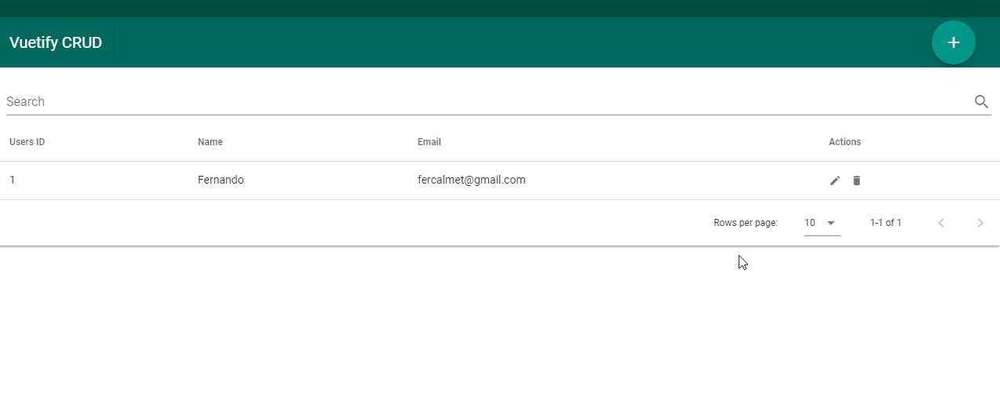

# Aplicación CRUD simple: frontend con VueJS usando Vuetify, Backend con PHP y MySQL
> Autor : Fernando Calmet  
https://github.com/fernandocalmet  
----------

Esta es una aplicación CRUD simple utilizando:
- VueJS
- Vuetify
- PHP
- MySQL

## Demo

## BUY ME A COFFEE :-)
